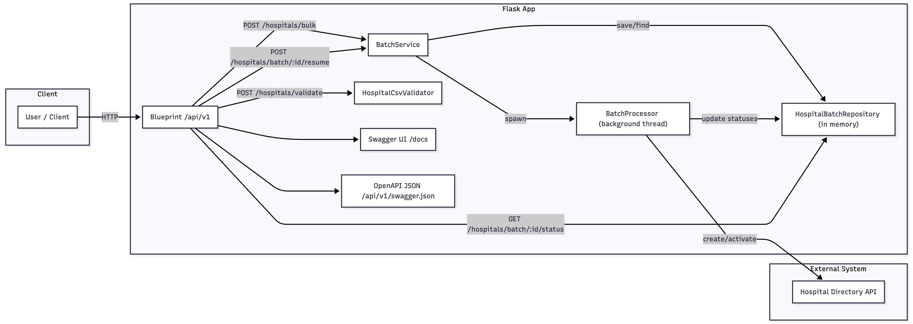

# Hospital Bulk Processing System

A Flask application that provides bulk processing capabilities for hospital records, integrating with the given hospital directory API.

## Demo

[Watch the demo video on YouTube](https://youtu.be/DiKcdwftWLI)


## Features

- Bulk upload and processing of hospital records via CSV files
- Integration with Hospital Directory API
- Batch management with unique batch IDs
- Comprehensive processing results and status tracking
- CSV validation
- Allows resuming of failed batches via the /resume endpoint

## Getting Started
 
### Prerequisites

- Python 3.8+
- pip
- Optional: Docker 24+

### Installation

1) Clone and enter the project directory
```
git clone <repository-url>
cd hospital-bulk-processing-system
```

2) (Recommended) Create a virtual environment
```
python -m venv .venv
source .venv/bin/activate
```

3) Install dependencies
```
python -m pip install -r requirements.txt
```

4) Configure environment
- Copy `env.example` → `.env`, then adjust as needed:
  - `HOSPITAL_API_BASE_URL` (required): Base URL of the Hospital Directory API (e.g., `https://hospital-directory.onrender.com`).
  - `MAX_HOSPITALS_PER_BATCH` (optional, default `20`): Upper limit per CSV upload.
  - `LOG_LEVEL` (optional, default `INFO`)
  - `LOG_DIR` (optional, default `logs`)
  - `LOG_FORMAT` (optional, default `default`)
  - `BATCH_STORAGE_DIR` (optional, default `batches`)
  - `OPENAPI_STRICT_DOCS` (optional, default `false`)

Minimal local setup example:
```
echo "HOSPITAL_API_BASE_URL=https://hospital-directory.onrender.com" >> .env
echo "FLASK_ENV=development" >> .env
```

### Running

- Without Docker
```
python run.py
```
App starts on `http://localhost:5000`.

- With Docker
```
docker build -t hospital-processing-system .
docker run -p 5000:5000 --env-file .env hospital-processing-system
```

### Running Tests

From the project root:
```
python -m pytest -q
```

### CSV Format

- Required columns (in order): `name,address`
- Optional column (3rd): `phone`
- Header is validated for order; column names are case-insensitive.
- Row rules:
  - `name` and `address` must be non-empty
  - If provided, `phone` must be exactly 10 digits
- Maximum rows: defaults to `MAX_HOSPITALS_PER_BATCH` (20 if unset)

Example CSV (`test_hospitals.csv`):
```
name,address,phone
Alpha Hospital,101 Main St,1234567890
Bravo Clinic,202 North Ave,
```

## Deployed Instance

Access the deployed project here: [Swagger UI](https://hospital-bulk-processing-system-n27v.onrender.com/docs).

## API Reference

Base path: `https://hospital-bulk-processing-system-n27v.onrender.com/api/v1`

### Health Check
- Method: `GET /`
- Success: `200 OK`
- Response example:
```json
{ "status": "OK" }
```

### Validate CSV (no processing)
- Method: `POST /hospitals/validate`
- Request: `multipart/form-data` with field `file=@<csv>`
- Success: `200 OK` (always 200 with validation result)
- Error: `400` if file missing/not UTF-8; `500` on server error
- Response example (valid):
```json
{ "valid": true, "errors": [], "row_count": 2, "header": ["name", "address", "phone"] }
```
- Response example (invalid):
```json
{ "valid": false, "errors": [{ "row": 1, "error": "name is required and cannot be empty" }], "row_count": 2, "header": ["name", "address", "phone"] }
```

### Bulk Create Hospitals (background)
- Method: `POST /hospitals/bulk`
- Request: `multipart/form-data` with field `file=@<csv>`
- Success: `202 Accepted` (starts background processing)
- Error: `400` on CSV validation failure; `500` on server error
- Response example (initial):
```json
{
  "batch_id": "<uuid>",
  "total_hospitals": 2,
  "processed_hospitals": 0,
  "failed_hospitals": 0,
  "processing_time_seconds": 0.0,
  "batch_activated": false,
  "hospitals": [
    { "row": 1, "name": "Alpha Hospital", "status": "pending" },
    { "row": 2, "name": "Bravo Clinic", "status": "pending" }
  ]
}
```

### Get Batch Status
- Method: `GET /hospitals/batch/{batch_id}/status`
- Success: `200 OK`; `404` if not found; `500` on server error
- Response example:
```json
{
  "batch_id": "<uuid>",
  "total_hospitals": 2,
  "processed_hospitals": 2,
  "failed_hospitals": 0,
  "processing_time_seconds": 2.43,
  "batch_activated": true,
  "hospitals": [
    { "row": 1, "name": "Alpha Hospital", "status": "created_and_activated", "hospital_id": 101 },
    { "row": 2, "name": "Bravo Clinic", "status": "created_and_activated", "hospital_id": 102 }
  ]
}
```

### Resume Batch
- Method: `PATCH /hospitals/batch/{batch_id}/resume`
- Success: `202 Accepted` with `{ "message": "Resume started", "scheduled": <count> }`
- Errors: `409` if batch already completed; `404` if not found; `500` on server error

### Swagger/OpenAPI
- Swagger UI: `https://hospital-bulk-processing-system-n27v.onrender.com/docs`
- OpenAPI JSON: `https://hospital-bulk-processing-system-n27v.onrender.com/api/v1/swagger.json`

## Working curl Examples

Assumes `test_hospitals.csv` exists in the project root.

- Health
```
curl -s https://hospital-bulk-processing-system-n27v.onrender.com/api/v1/
```

- Validate CSV
```
curl -s -X POST https://hospital-bulk-processing-system-n27v.onrender.com/api/v1/hospitals/validate \
  -F "file=@test_hospitals.csv"
```

- Bulk Create
```
curl -s -X POST https://hospital-bulk-processing-system-n27v.onrender.com/api/v1/hospitals/bulk \
  -F "file=@test_hospitals.csv"
```

- Get Batch Status
```
BATCH_ID=<paste-batch-id>
curl -s https://hospital-bulk-processing-system-n27v.onrender.com/api/v1/hospitals/batch/$BATCH_ID/status
```

- Resume Batch
```
BATCH_ID=<paste-batch-id>
curl -s -X PATCH https://hospital-bulk-processing-system-n27v.onrender.com/api/v1/hospitals/batch/$BATCH_ID/resume
```

Notes:
- Bulk processing calls an external Hospital Directory API at `HOSPITAL_API_BASE_URL`. Ensure it is reachable and correct.
- Logs are written under `logs/` (configurable via env vars).


## Architecture Diagrams

### High-level Architecture



### Low-level Bulk Processing Sequence


